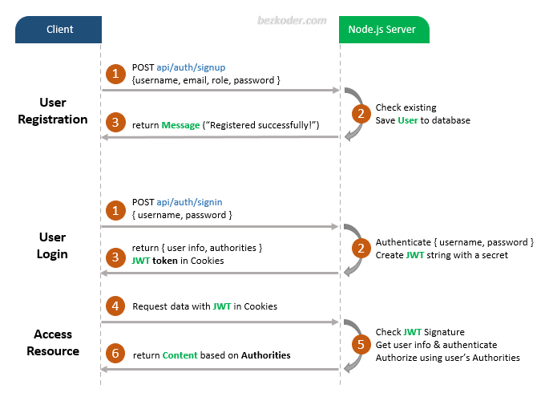

# Node.js Express Login and Registration example with MongoDB and JWT

- Appropriate Flow for User Login and Registration with JWT and Cookies
- Node.js Express Architecture with CORS, Authentication & Authorization middlewares & Sequelize
- How to configure Express routes to work with JWT
- How to define Data Models and association for Authentication and Authorization
- Way to use Sequelize to interact with MySQL Database

## User Registration, User Login and Authorization process.
The diagram shows flow of how we implement User Registration, User Login and Authorization process.



For more detail, please visit:
> [Node.js Express Login and Registration example with MongoDB and JWT](https://www.bezkoder.com/node-js-express-login-mongodb/)

## More Practice:
> [Node.js, Express & MongoDb: Build a CRUD Rest Api example](https://www.bezkoder.com/node-express-mongodb-crud-rest-api/)

> [Server side Pagination in Node.js with MongoDB and Mongoose](https://www.bezkoder.com/node-js-mongodb-pagination/)

> [Node.js Express File Upload Rest API example](https://www.bezkoder.com/node-js-express-file-upload/)

> [Node.js + MongoDB: User Authentication & Authorization with JWT (using HTTP headers)](https://www.bezkoder.com/node-js-mongodb-auth-jwt/)

Associations:
> [MongoDB One-to-One relationship tutorial with Mongoose examples](https://www.bezkoder.com/mongoose-one-to-one-relationship-example/)

> [MongoDB One-to-Many Relationship tutorial with Mongoose examples](https://www.bezkoder.com/mongoose-one-to-many-relationship/)

> [MongoDB Many-to-Many Relationship with Mongoose examples](https://www.bezkoder.com/mongodb-many-to-many-mongoose/)

Fullstack:
> [Vue.js + Node.js + Express + MongoDB example](https://www.bezkoder.com/vue-node-express-mongodb-mevn-crud/)

> [Angular 8 + Node.js + Express + MongoDB example](https://www.bezkoder.com/angular-mongodb-node-express/)

> [Angular 10 + Node.js + Express + MongoDB example](https://www.bezkoder.com/angular-10-mongodb-node-express/)

> [Angular 11 + Node.js + Express + MongoDB example](https://www.bezkoder.com/angular-11-mongodb-node-js-express/)

> [Angular 12 + Node.js + Express + MongoDB example](https://www.bezkoder.com/angular-12-mongodb-node-js-express/)

> [Angular 13 + Node.js + Express + MongoDB example](https://www.bezkoder.com/mean-stack-crud-example-angular-13/)

> [React + Node.js + Express + MongoDB example](https://www.bezkoder.com/react-node-express-mongodb-mern-stack/)

Integration on same Server/Port:
> [Integrate Vue with Node.js Express](https://www.bezkoder.com/serve-vue-app-express/)

> [Integrate Angular 8 with Node.js Express](https://www.bezkoder.com/integrate-angular-8-node-js/)

> [Integrate Angular 10 with Node.js Express](https://www.bezkoder.com/integrate-angular-10-node-js/)

> [Integrate Angular 12 with Node.js Express](https://www.bezkoder.com/integrate-angular-12-node-js/)

> [Integrate React with Node.js Express](https://www.bezkoder.com/integrate-react-express-same-server-port/)

## Project setup
```
npm install
```

### Run
```
node server.js
```
